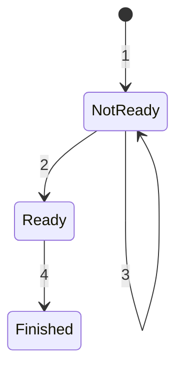

# futures explained in 200 lines of rust

## 1. [英文原版](https://web.archive.org/web/20230203001355/https://cfsamson.github.io/books-futures-explained/introduction.html)，[翻译版](https://nkbai.github.io/rust/Futures_Explained_in_200_lines_of_Rust.html)

## 2. 内容

### 2.1. 背景

以下特性仅基于文章中给出的例子总结：

||上下文切换|运行时特权级|代码读/写/使用|跨平台性|内存|时间|
|---|---|---|---|---|---|---|
|`OS 线程`|有|内核态，OS 调度|简单易懂易用|某些系统可能不支持线程|OS 线程栈相当大|系统调用昂贵，上下文切换，且不一定能按你想的那样快速切换回来|
|`有栈协程`（`绿色线程`）|有|用户态运行时|简单易懂易用|跨平台很难正确实现|线程栈大小可以自己定，但固定后的动态伸缩不易实现且有开销|与 OS 线程相比轻量级上下文切换；不一定能按你想的那样快速切换回来|
|`回调`|无|用户态运行时|`回调地狱`阅读困难；将别的逻辑重写为回调困难|大多数语言中易于实现，不过在 Rust 中难于处理任务间状态共享问题|相对较低，内存使用随回调数量线性增长|一般比线程快|
|`Javascript Promise`|无|用户态，`Javascript` 事件循环|解决了`回调`的代码复杂问题|得益于 `Javascript` 优秀的跨平台性|和`回调`一样的内存线性增长|一般比线程快|
|`Rust Future`（`无栈协程`）|无|用户态运行时|和其它语言不同，需要开发者主动提供一个运行时或者使用运行时库|`Future/async/await` 等核心逻辑不依赖于具体平台，与依赖具体平台的运行时解耦|保存在堆上（一般在堆上）的 `future` 结构体，一个 `future` 的大小为其对应的单个任务内部生命周期中最占空间的状态大小|一般比线程快|

### 2.2. 叶子和非叶子 future

- `leaf-future`：在整个异步调用的调用栈中，处于最底层的 `Future`。它内部绝对不会使用 `.await` 去等待其他 `Future`

- `non-leaf-future`：由 `async fn` 或 `async {}` 块编译自动生成的 `Future`。它内部会使用 `.await` 去等待其他的 `Future`（可能是叶子，也可能是其他的非叶子）

### 2.3. 运行时

Rust 的运行时分成 `Executor` 和 `Reactor` 两部分，两部分通过 `Waker` 进行交互。

`Reactor` 负责监听外部事件，并通过 `Waker` 通知 `Executor`。

`Executor` 驱动一个顶层的 `non-leaf-future`，并循环 poll。 

>有些执行器的实现是这样的：`Executor` 维护一个 `non-leaf-future` 的就绪队列，收到通知就不断从队列中拿任务调用它们的 `poll()`，返回 `Poll::Pending` 就放回队列，返回 `Poll::Ready` 就踢出队列。队列空了就让出 CPU。

### 2.4. 唤醒器 Waker 和上下文 Context

创建一个 `Waker` 需要创建一个 `vtable`，这个 `vtable` 允许我们使用动态方式调用我们真实的 `Waker` 实现。

### 2.5. 生成器和 async/await

Rust 中的异步使用生成器实现。因此为了理解异步是如何工作的，我们首先需要理解生成器。在 Rust 中，生成器被实现为状态机。

一个计算链的内存占用是由占用空间最大的那个步骤定义的。

这块内容以及后面的 `Pin` 和 Writing an OS in Rust 文章内容重合了。

### 2.6. 完整的例子

#### 2.6.1. 概述

见 `src/main.rs`：

- 执行器 Executor
    - `block_on`：在一个 loop 里不断调用 `mainfut.poll()`
    - `Parker`：基于 `Mutex` 和 `Condvar`
        - `Parker::park()` 中的 while 循环可以处理掉有可能出现的**伪唤醒 spurious wakeup**
- 反应器 Reactor
    - `Reactor`
- Leaf-Future
    - `Task`
- 唤醒器 Waker
    - `MyWaker`
    - `VTABLE`
- 任务状态 `TaskState`
- 事件 `Event`

#### 2.6.2. 梳理

##### Non-Leaf & Leaf Future

各个 `async` 块和叶子 future 的关系：

- `mainfut`
    - `fut1`
        - `Task` leaf-future
    - `fut2`
        - `Task` leaf-future

##### 状态转移

作为 `leaf-future` 的 `Task` 的 3 个状态：

```rust
enum TaskState {
    Ready,
    NotReady(Waker),
    Finished,
}
```

`TaskState` 状态转移图：



含义：

1. task 第一次被 poll 在 `Reactor` 注册：`Task::poll() -> else {...}`
2. `Reactor` 唤醒 task：`Reactor::wake()`
3. task 被 poll 但发现还没有准备好：`Task::poll() -> else if {...}`
4. task 执行完成：`Task::poll() -> if r.is_ready(self.id) {...}`

注意上图中的 `3` 线：这里的 `3` 在这个项目中**通常不会执行到**，可以试着在这个 `else if {...}` 代码块中打个断点验证。

##### Task::poll()

`task.await` 调用 `poll` 去 `Reactor` 检查当前 `task.id` 任务的状态：

- `TaskState::Ready`
    - 修改状态为 `TaskState::Finished`
    - 返回 `Poll::Ready(self.id)` 结束 `task.await`
    - 输出 `Got {task.id} at time: {...}` 结束 `fut[1-2].await`
    - 在 `mainfut` 中继续往后执行

- 任务注册过在 `Reactor::tasks` 中但没 `TaskState::Ready`
    - 处于 `TaskState::NotReady` 状态
    - 用新 `Waker` 覆盖旧的（这步还不太理解。明明这个项目里面用到的所有 `Waker` 都来自于 `block_on()` 里面创建的那个 `MyWaker`）
    - 返回 `Poll::Pending` 后 `block_on` 继续循环

- 任务没注册过
    - 表明该任务第一次被 poll 到
    - 注册并返回 `Poll::Pending`
    - `block_on()` 阻塞在 `parker.park()` 上等待别的 `parker` 通知

##### 事件

这个项目中没有实际来自底层硬件的事件来通知 `Reactor 线程`, 而是使用 `std::sync::mpsc::channel` 模拟事件。`mpsc` 即**多生产者-单消费者模型**。`channel::<Event>()` 返回 `(Sender<Event>, Receiver<Event>)`, 前者 tx 表示生产者，后者 rx 表示消费者，`Reactor::dispatcher` 拿到的是 tx，在 `Reactor::new()` 中拿到。但是这个项目中只有一个生产者 `Reactor::dispatcher`，一个消费者 `rx`。

`Reactor::dispatcher` 可以发送两类事件：

```rust
enum Event {
    Close,
    Timeout(u64, usize),
}
```

- 在 `Reactor::register()` 任务注册时发送 `Timeout` 事件
- 在 `Reactor` 被 drop 时发送 `Close` 事件，退出 for 循环，为 `Timeout` 而创建的线程通通 `join()` 之后，`Reactor` 线程结束并被 `join()` 后 drop 完成

##### 线程

项目依赖于 `std::thread` 线程模型。固定存在的 2 个线程：

- `主线程`：从 main 函数开始执行，通过`条件变量`阻塞在 `block_on()` 的 `parker.park()` 上等待唤醒

- `Reactor 线程`：在 `main() -> Reactor::new()` 中通过 `std::thread::spawn()` 创建，返回的 handle 存于 `Reactor` 中。**负责从 channel 中接收 `Event` 事件**，在没有接收到事件时阻塞在 `for event in rx` 行

此外还有为每个 `Timeout` 事件创建的线程：每当 `Reactor 线程`从 channel 中收到 `Event::Timeout(duration, id)` 事件后其便创建一个新线程：`sleep` 一段 duration 时间后执行 `Reactor::wake(id)` 唤醒操作。唤醒`主线程`的 `parker.unpark()` 就是在这个线程中被调用的。

所以 `Timeout` 线程做的便是模拟底层硬件事件到来监听到事件（`thread::sleep`）、唤醒操作。

#### 2.6.3. 三组件

##### Executor

这个项目里面没有显式定义 `Executor` struct（在其它某些项目里也有可能不会显式定义 `Reactor` struct），但并不是没有**执行器**，而是说执行器的权能由 `block_on()` 承担了。 

##### Reactor

```rust
struct Reactor {
    dispatcher: Sender<Event>,
    handle: Option<JoinHandle<()>>,
    tasks: HashMap<usize, TaskState>,
}
```

- `dispatcher`：生产者，负责发送事件
- `handle`：对应 `Reactor 线程`
- `tasks`：哈希表查找某个 id 的 task 对应的 `TaskState`

一般地，`Reactor` 监测硬件事件，并通过 `Waker` 通知 `Executor` 执行。但这里的“事件”是**由 `Reactor` 模拟**的。

>在 main 函数中创建的 reactor `let reactor = Reactor::new();` 的实际类型是 `Arc<Mutex<Box<Reactor>>>`，所以在 `reactor.clone()` 的时候调用的其实是 `Arc::clone(&reactor)`，给 `Arc` 强引用计数加 1 并返回一个新的 `Arc`，并且新旧 2 个 `Arc` 都指向同一个 `Mutex<Box<Reactor>>`，里面那份真正的 `Reactor` 并不会被复制。

##### Waker

```rust
struct MyWaker {
    parker: Arc<Parker>,
}
```

每个 waker 都共享 `block_on()` 中创建的那个 parker, 一个线程上调用 `parker.unpark()` 可以解除另外某个线程上的 `parker.park()` 的阻塞状态。这个项目中是由 `Timeout` 线程拿 waker.parker 调用 `unpark()` 解除主线程 `block_on()` loop 中的 `parker.park()` 阻塞。

根据 `VTABLE` 的设置：

- 调用 `waker.wake()` 会实际调用到 `mywaker_wake()`
- 调用 `waker.clone()` 会实际调用到 `mywaker_clone()`

`Waker` 的调用流程：

- `Reactor::wake()`：任务状态由 `NotReady` 设为 `Ready`
- `waker.wake()`：动态多态
- `mywaker_wake() -> waker_arc.parker.unpark()`：基于条件变量，修改 `park()` 中循环条件，通知某个 `parker.park()` 从阻塞恢复继续执行
- `block_on()`：循环得以继续

##### Waker 指针的传递过程

最初的 `MyWaker` 指针在 `block_on()` 中被创建，里面只有一个 `Arc<Parker>`，所以这个 waker 的本质作用就是：以后别人调用 `wake()` 时可以通过 `parker.unpark()` 把阻塞的执行器线程唤醒。

之后经过了 `Mywaker -> RawWaker -> Waker` 的转换，因为 `Future::poll(cx)` 只接受 `Context` 类型，而 `Context` 类型中只能存放标准的 `Waker`。也就是把自定义的唤醒逻辑，包装成 Rust Future 能够接受的标准 `Waker`。转换过程会经过一个比较底层的类型 `RawWaker`，由一个裸指针 `*const ()` 和一个虚函数表 `RawWakerVTable` 组成。

整个项目中会用到的所有 `Waker` 都来自于 `block_on()` 中创建的那个 `Arc<MyWaker>`，而 `clone()` 只是增加了 `Arc` 的引用计数。 

#### 2.6.4. 输出

多运行几次，你可能看到如下所示的输出：

```bash
Got 1 at time: 1.00.
Got 2 at time: 3.00.
```

`fut1` 和 `fut2` 是串行 `.await` 的，也就是 `fut2` 需要等待 `fut1` 完成才能被执行到。

`thread::sleep()` 的时间在 `Task` 初始化的时候就设定好了，即 `Task::data` 字段，将会成为 `Event::Timeout(duration, id)` 中的 duration，成为 `thread::sleep(Duration::from_secs(duration))` 中的 duration。

#### 2.6.5. 流程

|主线程|`Reactor` 线程|`Timeouot` 线程|
|---|---|---|
|`main()`|||
|`Reactor::new()`|被创建||
|返回继续执行|阻塞在 `for event in rx` 等待事件||
|`block_on()`|||
|进入 loop|||
|`Future::poll()`|||
|`mainfut`|||
|`fut1.await`|||
|`Task::new().await`|||
|`Task::poll()`|||
|任务初次被 poll 执行 `else {...}` 注册|||
|`Reactor::register()`|||
|任务进入 tasks 哈希表|||
|`Reactor::dispatcher` 发送 `Timeout` 事件|收到事件，解除阻塞状态||
|`Reactor::register()` 返回，`Task::poll()` 返回 `Poll::Pending`，`Future` 一路向上返回直到 `block_on()`，阻塞在 `parker.park()` 上等待唤醒|`match event {...}` 进入 `Event::Timeout(...) => {...}`|被创建|
||循环继续|`thread::sleep()`|
||阻塞在 `for event in rx` 等待事件||
|||`Reactor::wake()`|
|||`waker.wake()`|
|||`mywaker_wake()`|
|解除阻塞状态，循环继续||`waker_arc.parker.unpark()` 唤醒主线程|
|`Future::poll()`||当前线程等待被 `join()`|
|`mainfut`|||
|`fut1.await`|||
|`Task::new().await`|||
|`Task::poll()`|||
|`if r.is_ready(self.id) {...}` 返回 `Poll::Ready(self.id)`|||
|`fut1` 输出|||
|`fut1.await` 结束|||
|进入 `fut2.await`|||

`fut2` 的逻辑类似。

